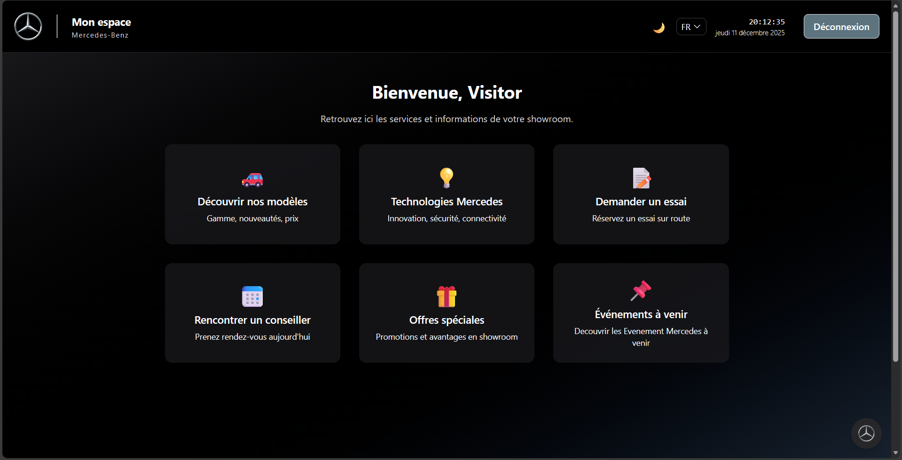
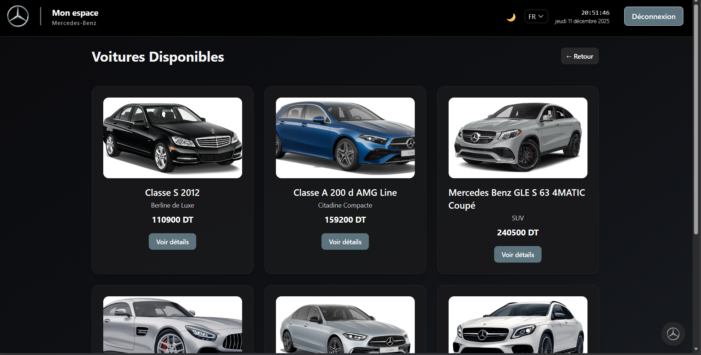
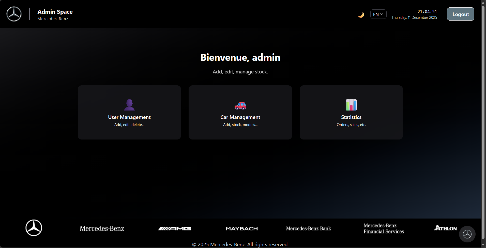
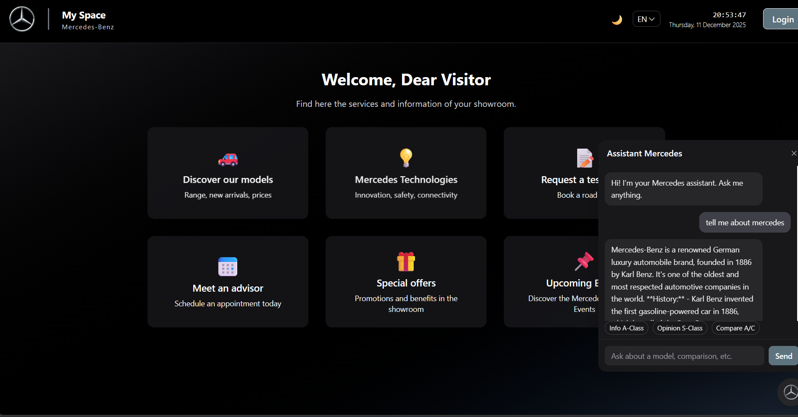
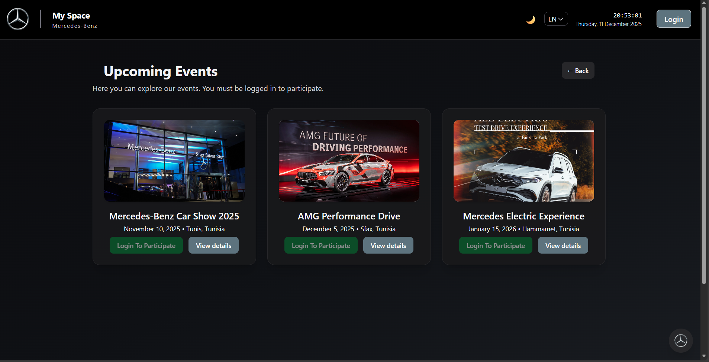

# 🚘 Mercedes-Benz Showroom Management App

[](https://vuejs.org/)
[](https://spring.io/projects/spring-boot)
[](https://www.mysql.com/)
[](https://tailwindcss.com/)
[](LICENSE)
[]()

---

A **full-stack web application** for managing a **Mercedes-Benz showroom**, offering a **luxurious experience for users** and a **powerful admin interface for staff**.  

---

## ✨ Features

- 🧑‍💼 **Admin Dashboard** – Manage cars, users, and appointments with complete CRUD control.  
- 🚗 **User Dashboard** – Explore cars, book test drives, and view AI-generated descriptions.  
- 🤖 **AI Car Descriptions** – Generate elegant car overviews in English and French.  
- 🌓 **Dark Mode & i18n** – Switch between light/dark themes and languages seamlessly.  
- 🔐 **JWT Authentication** – Role-based security for Admin and User.  
- 📷 **360° Car Viewer** – Interactive car rotation and gallery mode.  

---

## 🖼️ Screenshots

🏠 **Home Page**  


🚗 **Car**  


🧑‍💼 **Admin Dashboard**  


🤖 **AI Assistant**  


🗓️ **Events**  


---

## 🎥 Demo Video

🎬 *Experience the app in motion!*  
👉 [Watch the video](https://www.linkedin.com/) <!-- Replace with your real demo link -->

---

## 💼 Technical Details

- 👨‍💻 **Developer:** Yassin Medhioub  
- 🏢 **Project Type:** Summer Internship 
- 🧠 **Company Name:** Silver Star Sfax - Mercedes Benz Sfax   

---

### 🧩 Built With

#### 🖥️ Frontend
- Vue 3 (Composition API)  
- Vite  
- Tailwind CSS  
- Vue Router  
- Axios  
- LocalStorage  

#### 🧠 Backend
- Spring Boot  
- Spring Security (JWT)  
- Spring Data JPA  
- RESTful API  
- MySQL Database  
- Optional AI Service (OpenAI API Ready)  

---

## 🗂️ Database Structure

| Table | Description |
|--------|-------------|
| **cars** | id, model, type, year, price, images |
| **users** | id, username, role, status |
| **appointments** | id, user, car, date, status |
| **ai_descriptions** | id, carId, language, content |

---

## ⚙️ Installation

### 🖥️ Frontend
```bash
cd frontend
npm install
npm run dev
```

### 🤖 AI
```bash
cd frontend
npm run ai
```

### 🧠 Backend
```bash
cd backend
mvn spring-boot:run
```

> ⚙️ Configure your MySQL credentials and JWT secret inside `application.properties`.

---

## 📢 About the Project

> “Luxury isn’t only in the cars — it’s in every line of code.  
>  This app reflects the prestige, innovation, and elegance of Mercedes-Benz.”

---

## 👨‍🎓 Author

**Yassin Medhioub**  
Software Engineer Student | AI Engineering Enthusiast  
📧 medhioubyassin6@gmail.com 
🌐 [LinkedIn Profile]([https://github.com/NEMSS-DEV](https://www.linkedin.com/in/yassin-medhioub/))

---

> _“Luxury in every detail — from the dashboard to the codebase.”_
